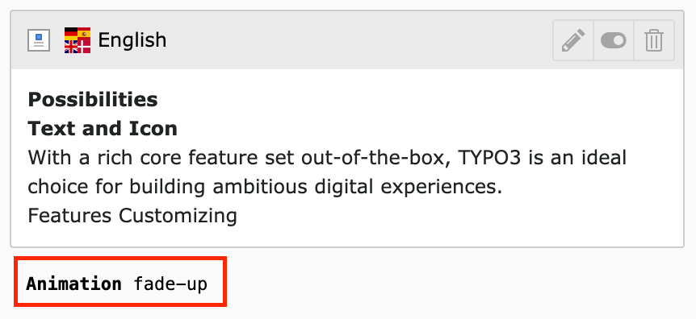
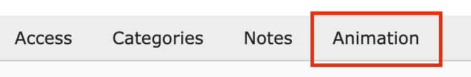
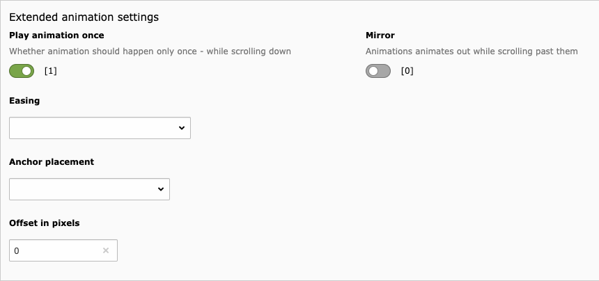

.. include:: ../Includes.txt

.. _developer:

====================
Administrator Corner
====================

Content Animations comes with some features which can be deactivated via the extension settings.

Settings
========

+------------------------------+---------------+-------------------------------------------------------------------+---------------+
| Feature                      | Data type     | Description                                                       | Default       |
+==============================+===============+========================================================================+===============+
| hideFooterAnimationLabel     | boolean       | Hide the Animation Footer Label                                   | false         |
+------------------------------+---------------+-------------------------------------------------------------------+---------------+
| disableAddAnimationsTab      | boolean       | Disable the automatic append of the Animations tab to all CTypes  | false         |
+------------------------------+---------------+-------------------------------------------------------------------+---------------+
| extendedAnimationSettings    | boolean       | Activate extended animation settings (for advanced users only)    | false         |
+------------------------------+---------------+-------------------------------------------------------------------+---------------+

Animation Footer Label
======================

You can hide the Label which shows the selected Animation value. It's visible by default.

Animation Tab
=============

You can disable the automatic appending of the Animation Tab to all CTypes. The Tab is added by default.

Advanced Animation Settings
============================

You can enable advanced animation settings for all CTypes (offset, anchorPlacement etc...). These settings are disabled by default.

Content Security Policy (CSP)
=============================

Content Animations is fully compatible with TYPO3's Content Security Policy (CSP) feature.

How it works
------------

When CSP is enabled in your TYPO3 installation, the extension automatically:

* Adds ``nonce`` attributes to inline JavaScript code
* Adds ``nonce`` attributes to inline CSS styles
* Ensures all animation scripts comply with strict CSP rules

**No manual configuration needed** - CSP support is automatic!

Enabling CSP in TYPO3
---------------------

To enable CSP in your TYPO3 installation:

1. Go to **Install Tool** > **Settings** > **Feature Toggles**
2. Enable: **"Security: frontend enforce content security policy"**
3. Clear all caches

The extension will automatically detect when CSP is active and add the necessary ``nonce`` attributes.

Technical Details
-----------------

The extension uses two EventListeners to load animation assets:

* ``AddAosJavaScriptEventListener`` - Loads AOS JavaScript with nonce support
* ``AddAosStyleEventListener`` - Loads AOS CSS with nonce support

Both EventListeners automatically detect whether CSP is enabled by checking for nonce availability.
When CSP is disabled, no ``nonce`` attributes are added, keeping your HTML clean.

.. tip::
   The extension handles CSP automatically. If you experience CSP violations,
   ensure your site's ``csp.yaml`` allows inline scripts with nonces:

   .. code-block:: yaml

      # config/sites/my-site/csp.yaml
      mutations:
        - mode: extend
          directive: 'script-src'
          sources:
            - "'nonce-proxy'"
        - mode: extend
          directive: 'style-src'
          sources:
            - "'nonce-proxy'"
